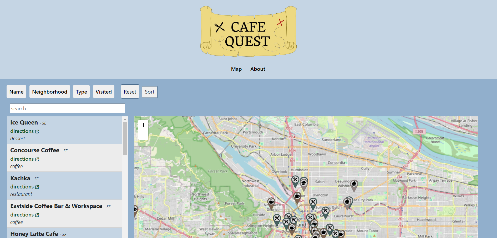
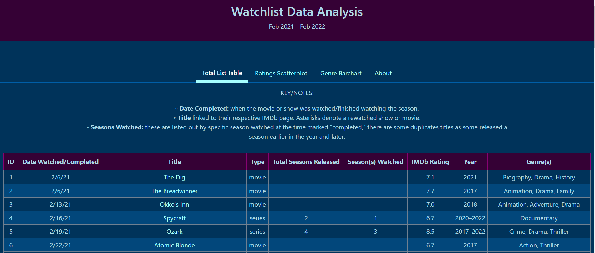
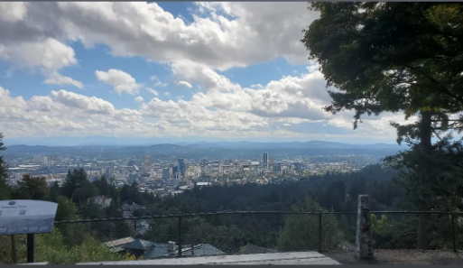
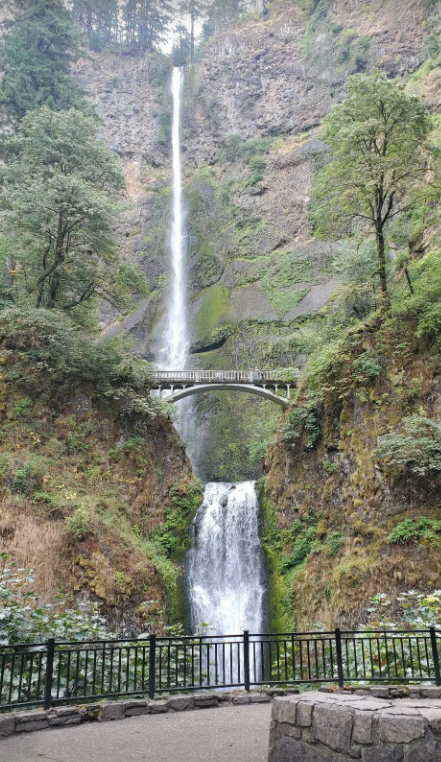

*Mt Hood from Trilllium Lake*

Hello and goodbye to August! I'm conflicted with this month as I'm not a huge fan of heat and it's usually the hottest month of the year and when my school year would start. Not anymore, obviously, but it's still hot. At least with the nicer weather means more opportunities for fun outdoor things. July turned out to be a pretty busy work and life month, so the first couple weeks of August were spent untangling that stress and onto more funtimes.

The rest of the month was spent reworking a couple older projects I've yet to update in my current portfolio, Cafe Quest and Watchlist data visualization. I guess this means they're officially at a version 2? I don't have a system right now 😛. Both had some additional CSS styling and mobile updates; such a pain to work with graphs and charts on mobile! I had moved both app's descriptions that were cluttering near the headers to have their own "About" tab.

## Project Updates:

**CAFE QUEST** - [http://cafe-quest.onrender.com/](http://cafe-quest.onrender.com/)
- a project to practice using [React Leaflet](https://react-leaflet.js.org/), I attempted to move some components around but v3 may have that…
- A search bar! Currently only filters by name and type in the list
- An updated header graphic sketched out by yours truly, and vectorized in Figma

**WATCHLIST DATA VIZ** - [https://watchlist-data-analysis.netlify.app/](https://watchlist-data-analysis.netlify.app)

- first attempted setting up with [Recharts](https://recharts.org/en-US/) and got annoyed with the odd graph CSS/styling issues and migrated the scatterplot and bar graph to [React Charts](https://react-chartjs-2-two.vercel.app/). Had to further tweak my data to fit into their graphing configs, but with the help of [Chart.js](https://www.chartjs.org/), got them mostly figured out
    - other graphing notes: the bar chart was moved horizontally due to the number of genres and readability. the scatterplot doesnt have the names anymore due to data/library limitations..
- Future add, I would like to add 2023 and 2024 data as I kept tracking things I've watched 😛 just not the rest of 2022 since i was building this

## Fun Stuff!
It's not all work, work, work here! The header image above was a sunrise paddle near Mt Hood, Oregon, the only time I will willingly get up at 3:30am 😂

Also met some new folks out and about, went to a pool party right before a thunderstorm hit, and more hikes, see below 😀

*Portland skyline from Pittock Mansion*

*Multnomah Falls*

")

*Waterfall on the Multnomah - Wahkeena Falls loop (forgot the name!)*
