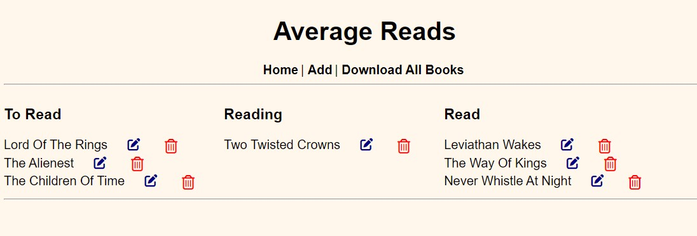

Welcome to fall, the time has changed in the US, and pumpkin everything! Let's jump right in.

## Average Reads version 2!
For some backstory on version 1, I have a write up [here](https://github.com/haleyelder/cs50/tree/main/cs50p/week9/project).

For the next iteration of the project, I wanted to move it to a web based framework to practice as a fullstack application and easier to use and read. This version is much closer to what I had envisioned when starting! The application is now using Flask and SQLAlchemy to add, edit, and update books across the three reading lists and ability to download all three to a CSV on your own computer.

The trickiest part, besides deploying, was once again the CSV download portion. I could carry over the "save to a CSV," but had a learning curve when it came to saving to a  person's computer. There was something about creating and saving a specific static folder _then_ downloading it. I had kept some of the same functionality for error handling, such as, checking if a book was already on one of the three lists, if there were no books to download, and title case any entered book titles.

There are a few more enhancements I'd like to do with this one, but needed a break. Definitely updated styling, some backend functionality, and sketched out another graphic for the header.

--------

## "Do It Anyways"

We're taking Nike's "Just Do It" (not affiliated) and switching it up. This the meh part of the post and feel free to skip ahead. Or it could spark something in you too?

Over the past few months, just after Average Reads was deployed, my brain went into unnecessary stress about my current career progression. Although, I do have generalized anxiety (GAD), so it's not that hard to do but it is a tough one to untangle.

For some time now, I have mentioned when introducing myself that I have been doing code on the side, and up till now has been these smaller projects and self learning. I'm a bit tired of saying that on repeat but also fearful to apply or reach out to people for advice, I have limited spoons for that. [Spoon theory](https://en.wikipedia.org/wiki/Spoon_theory) for those who haven't heard of the term. I know I want to work on full stack projects, but I also have found an interest in data analysis, I've been having a tough time focusing on either of them.

I had thought this year, it'd be okay to take a break from making strict goals, but for a goal-oriented person, that didn't really shake out well. It also doesn't help to see three separate women in tech groups I was part of disbanded this year. People are still being laid off left and right, and most job roles are still focused on senior with a heavy saturation at the entry level. How can one stick to positive growth with that looming over your mind, why bother if it's so difficult to get hired?

So, feeling back at square one a little bit. Found a bit more alignment and felt well might as well "do it anyways," the time will pass anyway. Even when I wasn't creating or learning, I was still thinking about building with code.

The "do it anyways," came from when I've heard folks on hikes, forums, or chatting where they have their own doubts in what they wanted to do; go somewhere, do a thing, learn a craft, etc. I would say "do it anyways!" It sounds a bit like toxic positivity now that I think of it, but why not try it now and if you hate it, then move on? Or maybe you find you do like doing that thing?

So, here I am, reviewed the [Odin Project](https://theodinproject.com/) curriculum for the nth time, put the sections in a spread sheet to note when they are reviewed or done, and I can continue on with that. I'm sure there will be times I will try and find something that "works better" but for what I need right now to keep going, this should be it.

So, do it anyways...?

If you made it this far, thanks! This is mostly me whining to the ether but I hope to come back to this post and see where I got after a few months; could be worse or better. Time will go on, you can either start now or let it pass.

p.s. another reason I've been a bit MIA, I have finished a quilt and wiil post about it soon! Gotta keep up with the craft part of this blog too, ya know🧵
