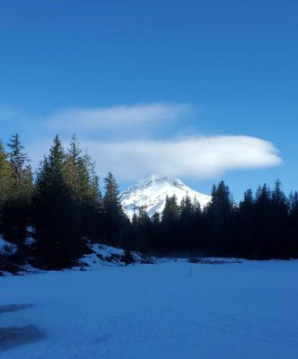
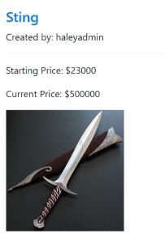
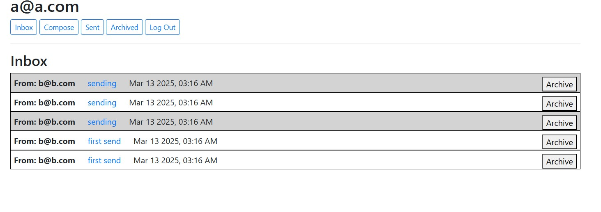

First recap of the year! I was thinking of doing a monthly, but it felt a bit unnecessary once reaching the end of January and figured quarter would be easier. Turned out to be a pretty busy quarter of activities!

#### Hikes
Total: 4;  there was quite a variation of conditions and weather over the past couple of months, but pretty normal for unpredictable PNW winter and spring.

- a short, flat portion of the [Crown Zellerbach](https://www.alltrails.com/trail/us/oregon/crown-zellerbach-trail--4) trail for a New Year's Day hike
- [Moulton Falls and Bell Mountain](https://www.alltrails.com/trail/us/washington/moulton-falls-and-bell-mt-loop), very rainy day
- [Mirror Lake](https://www.alltrails.com/trail/us/oregon/mirror-lake-loop-trail) trail, a very cold day (started at 23F)! I haven't hiked in colder temperatures much or quite knew how to layer for it. All went well and officially now own my own microspikes.
- [Trappist Abbey](https://www.alltrails.com/trail/us/oregon/trappist-abbey-guadalupe-loop), cloudy day, but very muddy!

*Mt Hood from a frozen Mirror Lake*

#### Run
- third time was the charm; I signed up for the Shamrock 8k and finally jogged it! In ~56min 😎 Surprised at my pace, faster than expected. I used a general mileage plan for 9ish weeks leading up to the race and run/walk intervals. I was equally suprised to have no random aches or knee issues like I have in the past. Feeling accomplished and proud 😁
- swapped app tracking from Strava to MapMyRun since something messed with Strava tracking and would say my pace was around 4 minute miles?? Definitely not. The 'delay to start' is a real game changer!
- Looking ahead, 10k looks way more feasible now. I've usually done 3ish runs a week and tempted to move to 2 and more cross training... we'll see. Might hop over the 10k and go straight to a quarter marathon 👀

#### Books
- Total: 9
- started up a new book club (listened to "Pride and Prejudice"), returned to a past one after a break (read "The Keeper of Hidden Books"), and continued with an online group (read "Words of Radiance", 1000+ pages 😵)

#### Code
- I've been wanting to move my locations data file for [Cafe Quest](https://cafe-quest.onrender.com/) and try testing out an open source database platform [Supabase](https://supabase.com/). Once connecting the database and importing my locations, there were some further tweaks to get the list to load again and I had to add a delay to call the data from the web. Since I don't update the list often, I've been getting emails it's been paused due to inactivity. So, now list could look like it's broken most the time 😕. Might go back to the local file or another host, the pausing is a bit irritating.
- A surprising to me win, I restarted [CS50Web](https://pll.harvard.edu/course/cs50s-web-programming-python-and-javascript) and finished two projects way ahead of my personal deadline. Commerce (a mock auction site) was the one I left half done a couple years ago, picked it back up, and passed grading. I also finished Mail (a mock email inbox app) and currently working on the next project Network.

_I decided to use Lord of the Rings items to bid on for Commerce test data, how about $1000 starting on the One Ring??_

_Mail wasn't too exciting but got to practice some JavaScript again_

Not much will probably change goal wise from these, continuing on jogging, hiking, and who knows what else; see ya next time in June 🌞

- H
