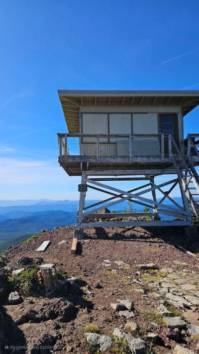
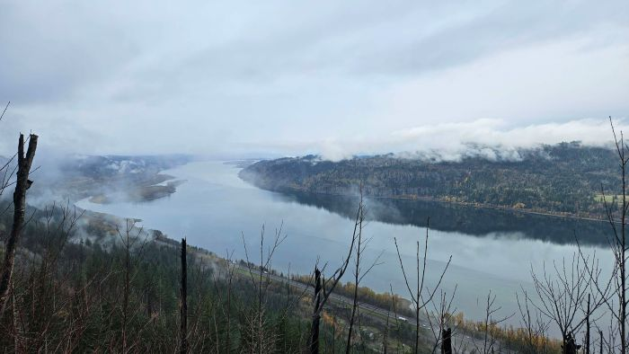
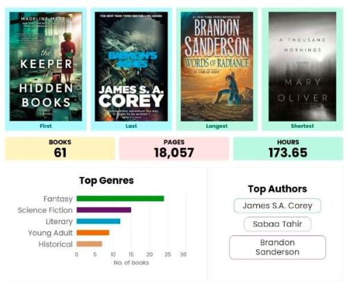
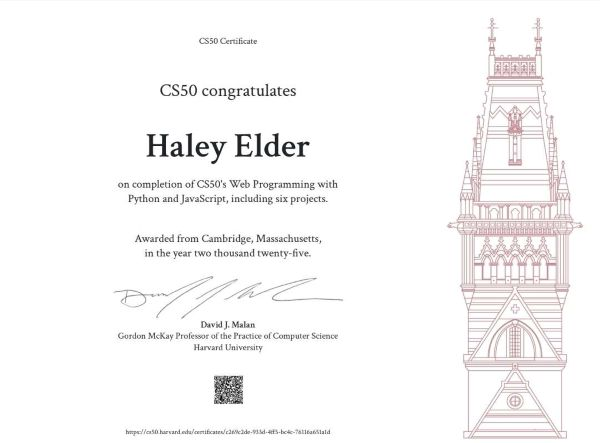
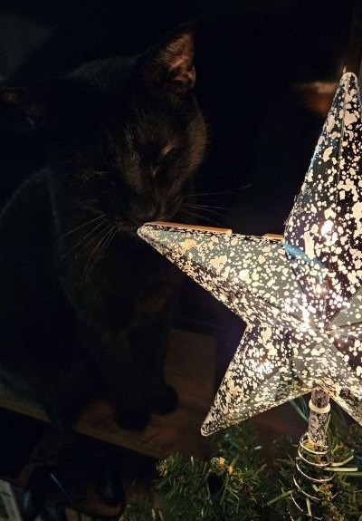

One more for 2025! I'm still drafting up some 2026 goals and getting those organized, and took some downtime post holiday frenzy.

#### Hikes
Total: 2! The shortest list of hikes this year, and that's okay! The two that made the spot are ones I've been meaning to do for a while and wonderful. It was going to be three, but the third was cancelled due to weather and then the holidays happened.

- [Indian Race Track to Red Mountain Lookout](https://www.alltrails.com/trail/us/washington/indian-racetrack-trail-to-red-mountain-lookout) - completing a goal of visiting a lookout! Could see four mountains from the top (Helens, Adams, Rainier, and Hood). Also saw a drum gathering on our way down; it was odd asking "do you hear drums?" to the group. 😄
- [Angel's Rest](https://www.alltrails.com/trail/us/oregon/angels-rest--3) - not as scary as I thought, and will be back! It was super foggy when we reached the top, waiting about 20min, and the view cleared! I know some folks do sunrise or sunset ones here, maybe 2026?

_Red Mountain Lookout_

_Fog clearing in the Gorge coming down from Angel's Rest_

#### Run
Pretty low activity for this one, next to zero. I sort of restarted None2Run from the super basics, but had to pause for shin splint aches :( I assume this is related to my foot strain, gait was affected and did a lot of walking in the meantime. Next attempt starts tomorrow! No rushing this time.

#### Books
Total: 21! This beat my previous quarter, and December was highest read month all year. I got more into listening to books with the Expanse series, which eased in other books I could listen to as well. I have a goal of 40 For 2026, but I'm also focusing on more diverse settings around the world, reading off my shelf, and series completion.

_61 books this year!!_

#### Code
Early in the quarter, I was finalizing my CS50Web final submission, sent it in, and had a couple of stressful weeks waiting for the response. I PASSED! I started the course three years ago, and feels good to get this one done 😁

Otherwise, I've been working behind the scenes customizing my own Astro blog site to release soon-ish. I like this template, but there is so much more going on than I need and I wanted to organize posts a little different. Stay tuned for the official release 👀

_feeling accomplished!😎_

#### Life
Keeping up with a variety of events and outings (somehow); a mixture of a tech conference ([BSides PDX](https://bsidespdx.org/)), food + friend outings, and book clubs. This year, I partiicpated in a holiday card swap and in total, with familiy and friends sending in, 15 in total! I'd like to do it again next year, it's fun to get non-spam/bill mail once in a while 😅

_Holiday cheer with the void_

While brainstorming possible posts and frequency for 2026, I definitely want to do more than these recap posts, but they are also a good reminder to myself what I've done. Prior to drafting this one up, it felt like the fall was a bit slower, but it was still a bit busy! Good busy. Once goals are all outlined and what not, that post will be up sometime this month. January is kind of a "settling in" month, especially after the holiday slump. Who knows, may coincide with the blog refresh... till then!

-- H
