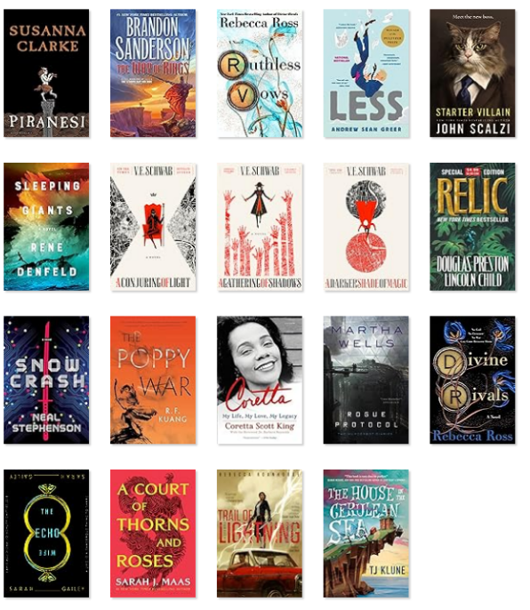
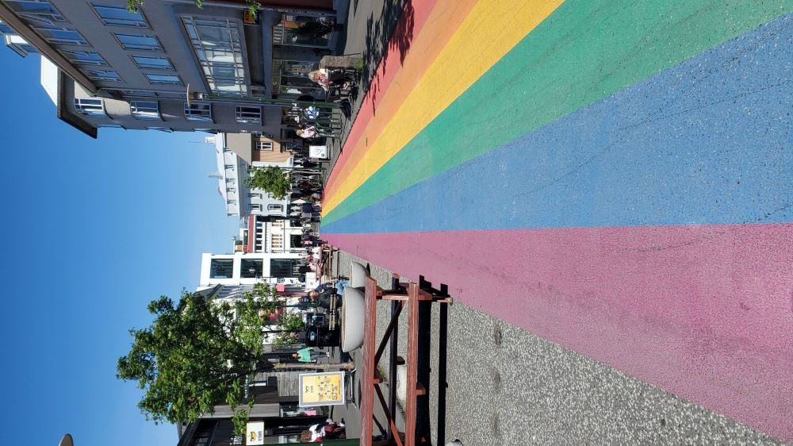
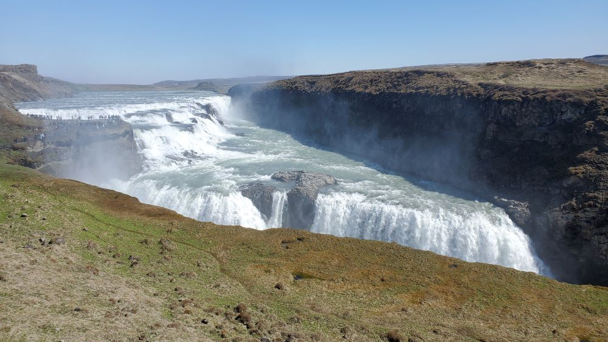
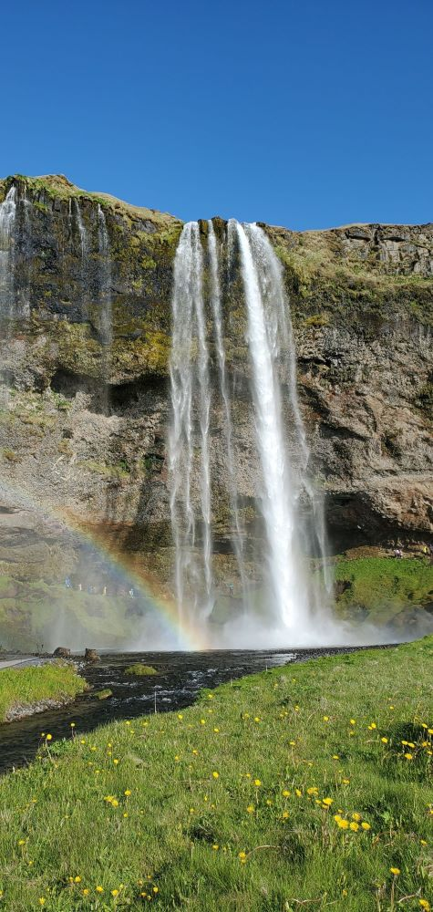
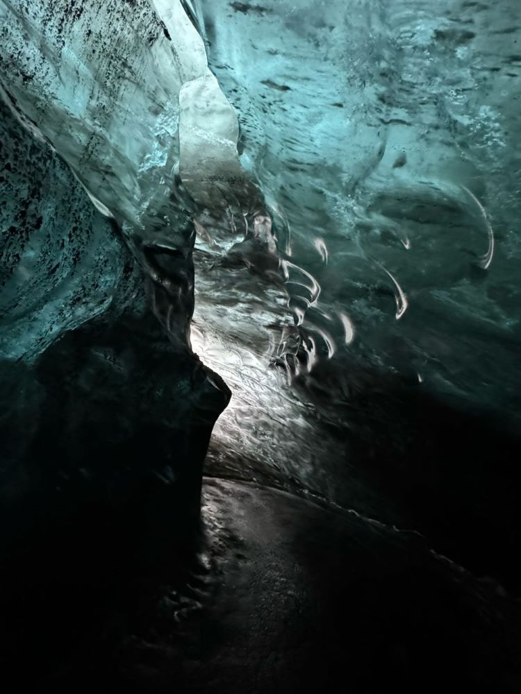
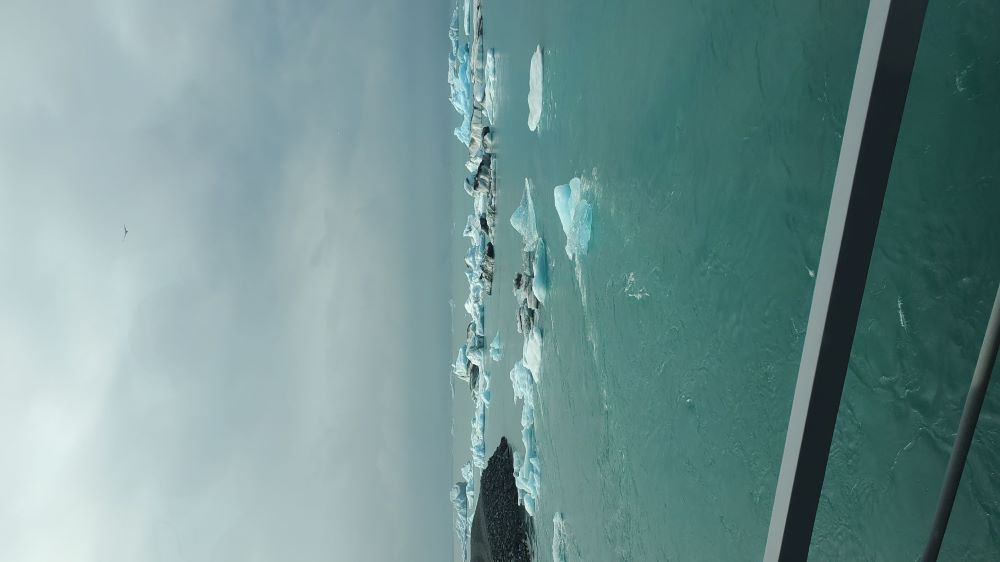

*cover image of lupine and Svínafellsjökull, near Skaftafell, Iceland*

Oh this has been a busy year so far! I had it in mind to do a check in and/or recap a bit ago but here we are halfway into the year. As per most years, I usually lose a bit of steam in the winter months due to post-holiday blues and SAD (seasonal affective disorder). This year also tossed an ice storm in February and the passing of a loved one. During said ice storm, I had done my first 5k on a treadmill in a lonnnnnng time, but incidentally pulled a muscle that took a bit to recover. I’ve missed a few races I had signed up for this year and maybe not picking a goal race is the goal from here on out.

The rest of spring I spent reworking my portfolio and this here blog on Astro! Once getting through the tutorial and understanding the workings of Astro, I like it quite a bit and tweaked [this](https://github.com/themefisher/bookworm-light-astro) Astro theme for my own.

The other remaining bits of spring was prepping for the main event of my year, ICELAND. It was great, amazing, and I don't know what else could live up to that...seriously. I saw the posting for the group trip last year and immediately put down a deposit, then waited a year… Since it was scheduled around my birthday, it was a gift to myself 😁 I've included a bit of a sampling of photos from the week as I took around ~1,100 😵 I like taking lots of pictures!

Coding wise, I’m still a bit dragging to get back to practicing and projects, but it’ll happen. It’s kind of a burn out feeling but not sure what else. I have a list of courses and projects I want to get to but it's tough to get the determination back to get into it. In the past, past I’ve used a “power hour” tactic to set a pomodoro timer to 30min, sometimes with a tiny 2min break, or decide to keep skip the break and go for another 30min, and that’s it for the day. Some days it’s shorter, or longer.

I don't feel _too_ bad about missing some of it as I've continued to cram in quite a bit of reading this year. The below image are the books I've finished this year as of the end of June. Yup, Way of Kings completed! That’s about ~1000 pages and even finished at least 2 books during..phew.

----------------
Some Iceland spam :)

*Reykjavik Rainbow road*

*Gullfoss, Iceland; foss means 'waterfall'*

*Seljalandsfoss, could walk behind this one!*

*Skógafoss; not pictured, to the right are ~500 stairs to the viewpoint at the top, made it with a few pitstops on the way*

*walked on Breiðamerkurjökull (glacier) to an ICE CAVE, unreal, jökull meals glacier*

*Jökulsárlón glacier lagoon, we got a boat ride around them, held some ice and ate a piece of it*

------------------
Until next time, hopefully not another 6 months 😉
