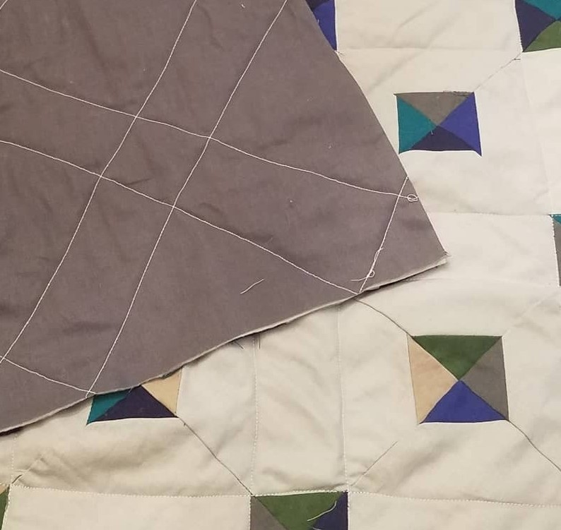
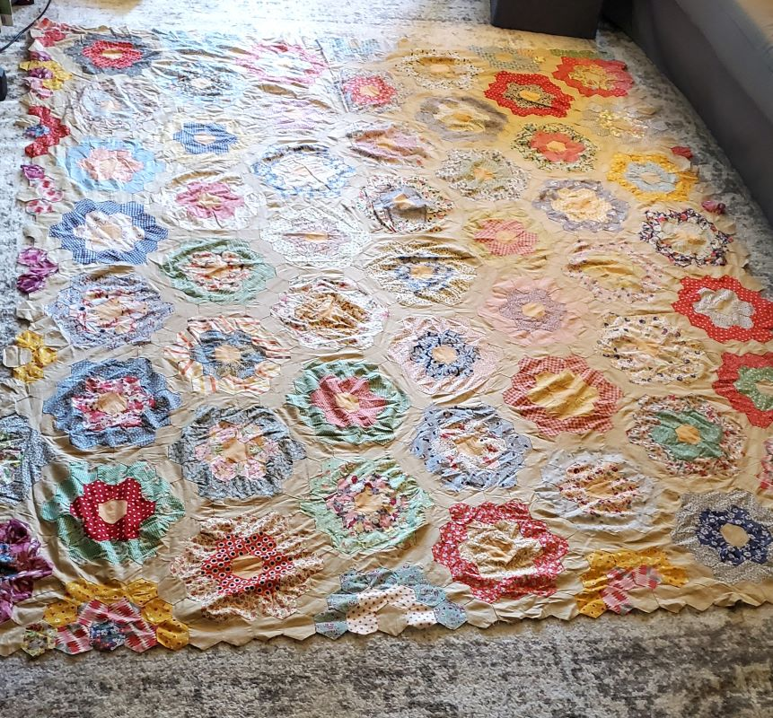
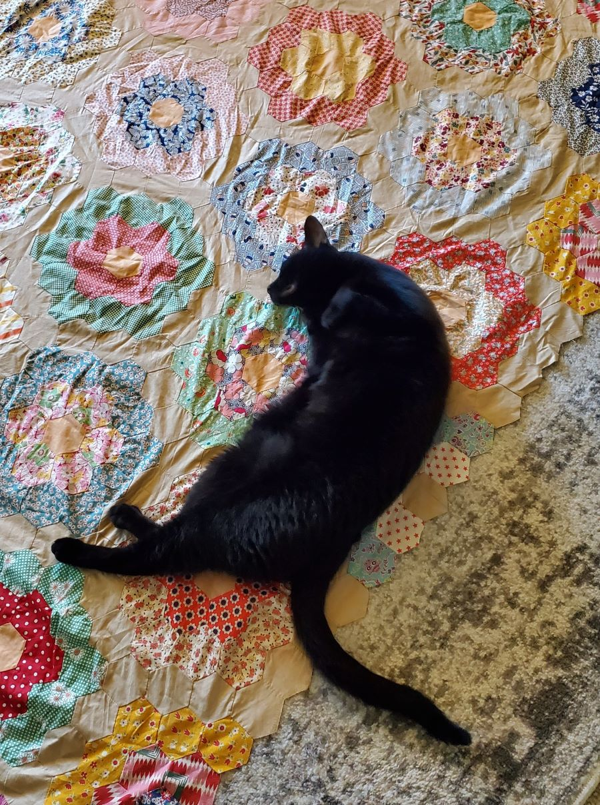
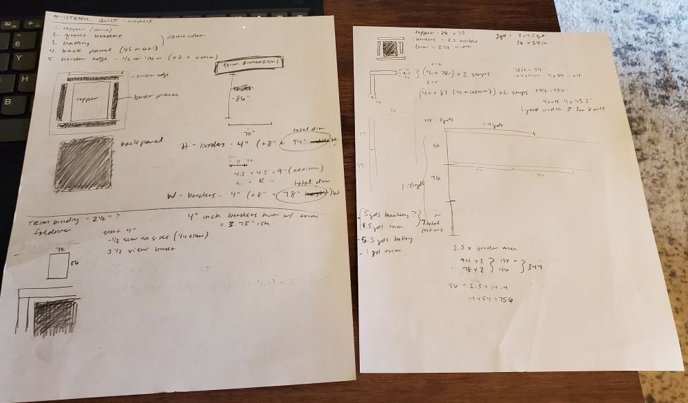
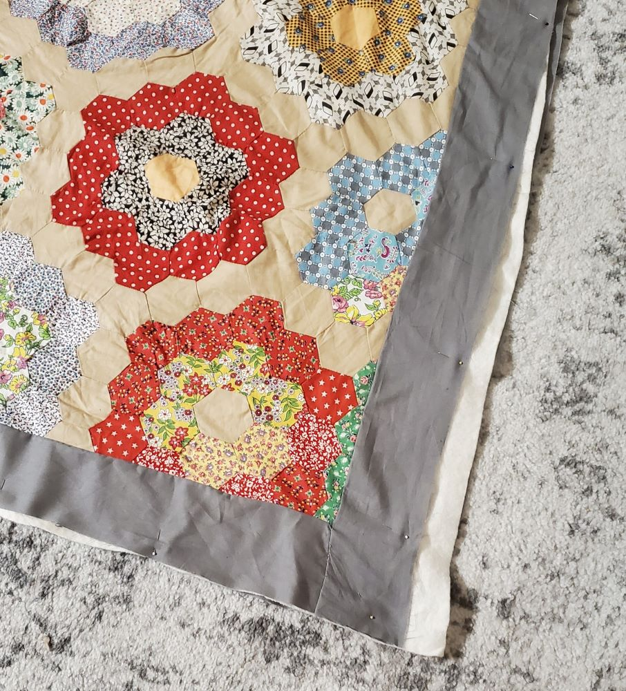
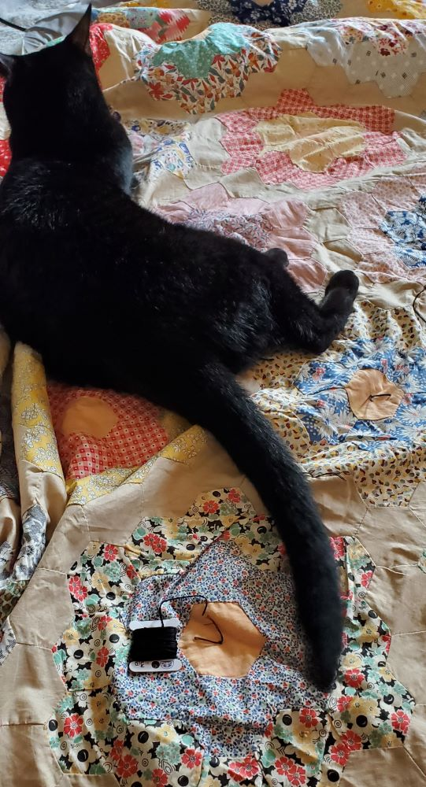
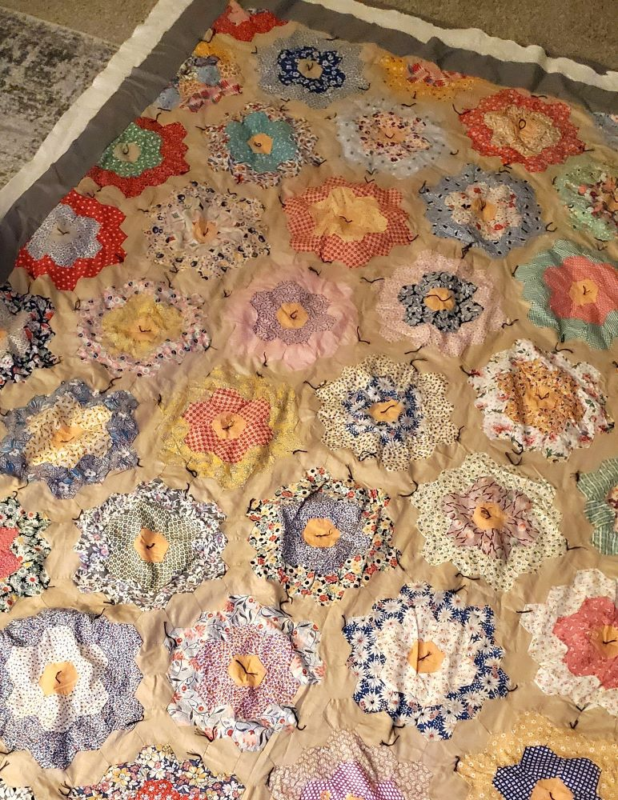
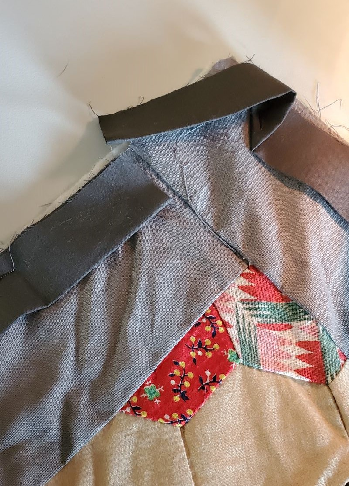
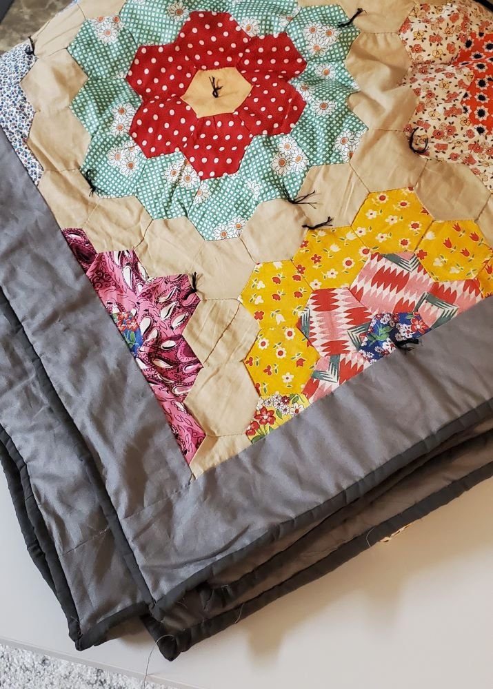
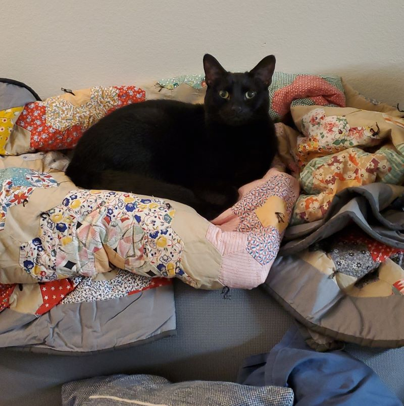

Last year, a quilt topper, the main design of a quilt, was found at a family member’s home. This person wasn't exactly known for sewing, at least recently, let alone a large quilt design. Was it sewn years ago or gifted? No one knew. The real name for the design is [Grandmother's Flower Garden](https://www.patternsfromhistory.com/colonial_revival/flower_garden.htm), but I still like to call it the Mystery Quilt. As a resident crafty person in our family, who has finished a quilt before, I was tasked to complete it.

I decided to use the [Tiny Tile Quilt Pattern](https://www.purlsoho.com/create/2015/06/08/tiny-tile-quilt/) as a gift for my parents a few years back. That one was a full-sized design, and soon found this mystery quilt would be a bit larger.

_nearing completion of the Tiny Tile Quilt_

The first thing I noticed, besides the _interesting_ mix of fabric colors and pattern designs, were the exposed edges of this hexagon-based quilt. They were not trimmed at all and some sections jutted out farther than the rest. I had to lay it out on the floor to measure it flat and trim where needed. Due to the size, I switched to using a tape measure to note at least three different widths and average out the measurement to trim evenly.

_quilt topper pre-edge trim_

_My cute little assistant; he loves to be involved (aka getting in the way)_ 😻

Here was the most fun part (sarcasm). If a student asks: “When are we ever going to use this random math equation in real life!?”, here's your answer. This is where you can use your high school geometry classes to calculate the area of fabric needed to cut and sew. I’d need fabric for the front border (optional, but I like to include one), backing fabric, batting, and trim to tie it all together.

As a visual learning type person, I've picked up that I prefer to grab scrap paper and work out designs and calculations in a separate area. This also happens with some programming problems I've gotten stuck on. From here, I get a rough estimate for how much yardage and measurements will be needed, but also factoring in additional seam allowance, usually a quarter of an inch, around each piece. Sewing can get complicated! To err on the side of caution, I added some extra fabric estimates in case my calculations were off.

_see, showing your work CAN help!_

From here, we can finally go to the fabric store! From my calculation step, I had to check how tall the average bolt, cardboard piece wrapped to hold yards of fabric, would be. Once at the store, the bolts I was looking at were taller than expected, which meant less sew joins for the backing fabric. I decided to use neutral grays for the borders and trim as the topper pattern has a wide array of colors and pattern designs to even it out.

I didn’t take any pictures of cutting the fabric; that part wasn't too exciting. On to sewing! The front borders were sewn on first and thankfully no real issue there, but noticed later during trimming, I had to cut down a bit more than expected but was still okay. It was already a large topper, and now with the border, we’re losing more room on the floor!

_front borders sewn on, placed on the batting, and backing fabric_

For my last quilt, I tried machine quilting on my own sewing machine using a walking foot; I could barely fold and fit all the layers in my machine to sew it. A walking foot is an attachment to allow you to sew more layers of fabric at once, hopefully, without breaking your machine. Since the topper is larger this time, I decided to go with tying it with the embroidery thread. Originally, I wanted to use yarn, but the sharper needle eye wasn't large enough to hold the yarn, and my yarn needles weren't sharp enough to go through all the layers. Starting from the center and working out through each quadrant to the edge, I followed a specific pattern of tying to go around each hexagon "flower" and ended up with at least 250 stitches.

_the helper "helping"_

_hundreds of tied threads later..._

Now, back to sewing with the walking foot again. One of the last tasks is to sew the trim edge with the machine to join all quilt layers on the front side, and then hand stitch the trim to the backing. The straight lines on the front are pretty easy to accomplish, but there are specific sewing and fold steps to get the miter corners just right. These weren't as clean as my first quilt, but that's okay, I'm sure no one else will notice. 😉

_yarn chicken became border chicken. had JUST enough cut to finish the edge_ 🤯

Once the border was sewn on, and fixing up the corners a little bit, I did a machine wash and was ready to show it off! This project started late September and finished early November so I could bring it with me to see family for Thanksgiving. I thought once I was done, I’d give it to someone in my family, but decided to keep it for myself. It's a very cozy blanket, and even though I wasn’t so sure of the wild color choices, it’s got a great story and work behind it.

_folded and ready to go!_

_QA tester at work, he approves_
