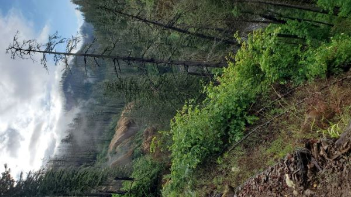
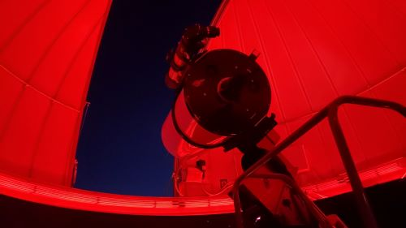
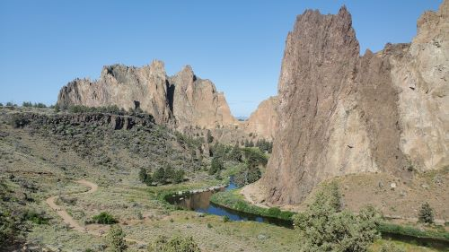
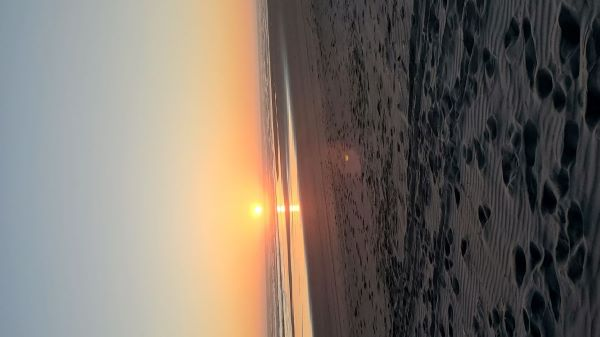

Oh hey there, July...this post is a few days late and yes I was procrastinating. I've heard plenty of people use the phrase "the year is flying by" and now I believe it! It was due to good busy again, at least, let's get right to it:

#### Hikes
Total: 7, including a few I've been wanting to do for a _while_. Some are urban/shorter hike/walks but they still count!

- [Mosier Plateau](https://www.alltrails.com/en-gb/trail/us/oregon/moiser-plateau) for wildflowers!
- [Salmon River Trail](https://www.alltrails.com/en-gb/trail/us/oregon/salmon-river-trail-short-option)
- [Eagle Creek to Punch Bowl Falls](https://www.alltrails.com/en-gb/trail/us/oregon/eagle-creek-to-punchbowl-falls)
- [Gabriel Park Loop](https://www.alltrails.com/en-gb/trail/us/oregon/fanno-creek-greenway-loop)
- [Smith Rock - Crooked River Trail](https://www.alltrails.com/en-gb/trail/us/oregon/crooked-river-trail)
- [Tumalo Falls & Double Falls](https://www.alltrails.com/en-gb/trail/us/oregon/tumalo-falls-and-double-falls)
- [Jay Trail - Bird Alliance](https://www.alltrails.com/en-gb/trail/us/oregon/jay-trail--2), added an extra loop and started at Lower Macleay Park for mileage

_Eagle Creek Trail_

#### Run
- partially unintentional, but I signed up for 3 runs in May 😬 2 were "fun runs" and the last was my 10k! Not many consider a run "fun," but those were the Humane Society's Doggie Dash (my fifth time!) and an Oregon Trail Game 5k, which was actually pretty fun. There are pit stops to pick up a choice along the route, enter in the end and it'll say if you made it or not; I didn't 😥
- the last run I picked the Helvetia Half - 10k distance so I could have someone else figure out the route for me. I debated a virtual so I can do it whenever, but this timing and organization worked out better.
    - I didn't have a hard set goal for this race besides finish. There was the tiniest pace goal of "if I walked most I should be done by 1:15", and made it in 1:08!
- Since the race, I've been a bit more busy with hiking and trips over the past month but I definitely felt the mental health rammifications of stopping the consistent movement. And pair with a stressful work project, I was a bit stressed and not sure where to put that energy! Restarting this week 😎 and added "fun" of summer heat to dodge.

_Telescope at the Hopservatory - Bend,OR_

#### Books
- Total: 12! A continued mix of book club picks of varying topics and personal choices. I've grabbed 2 summer reading bingo boards from 2 shops and aware of a third. Not sure if they'll be filled out properly but gave some nice options to expand horizons of read picks, i.e. "genres you dont usually read", "local authors", or "a reread older than 5 years".

_Smith Rock_

#### Code
- I continued chipping away at my Django capstone in the beginning of the quarter but took a bit of a break nearing the end of the project. Now the main item to complete is the design; why does that seem so hard?? Oh, and also mobile responsive.. Still ahead of my personal deadline to finish, so it's all good.
- I also worked a bit to migrate Cafe Quest away from Supabase as it continues to pause due to project inactivity. It looks like there are no locations or data on the web page if this happens. I moved some data to test with Appwrite, but it's a NoSQL database, reminiscent of Firebase and I'm kinda meh on using that ... we'll see. Supposedly no pausing on hobby tier!
- I'd like to get back to all my other dangling side projects! (Average Reads still needs a header graphic...) Plus would like to customize this Astro blog a little bit...

#### Life
- an extra area cause June was a big month! Birthday month for me; had a short hike, heatwave, and book club meet on the actual day. Midweek went to a concert, and then annual adventure trip with my mom to Bend 💖 It was a lot of fun!
- one reason I was procrastinating this post was taking some time off to head to the coast for a friend reunion trip, it's been a while!

These are still kinda fun to see what I can remember from the past quarter 😅

- H
