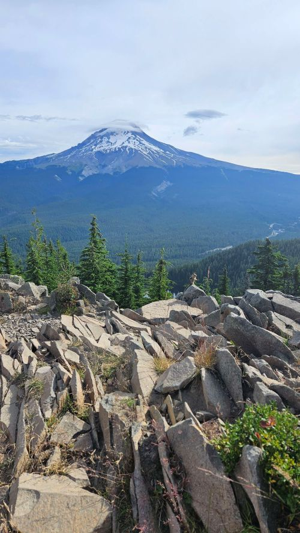
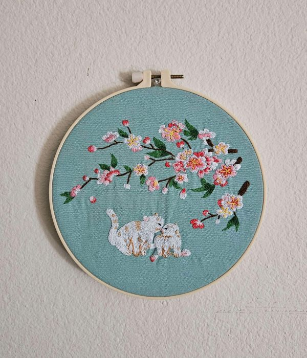
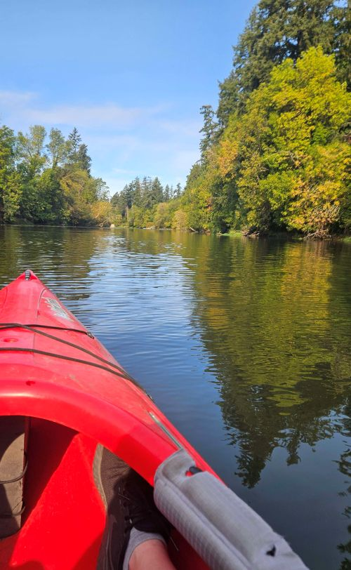
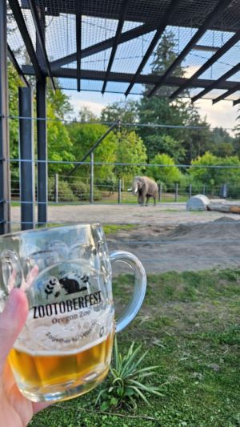
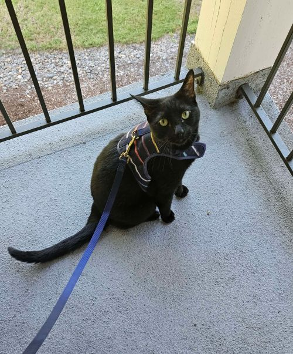

Another lil delay, it was a busy start to the month! And finally feeling a bit more like fall and feeling ready for it. Some rain, sunny fall colors, and pumpkin everything. And also the last quarter of the year, what the heck. Let's see how the second went...

#### Hikes
Total: 5. Sort of 9, but four were very short waterfall walks/viewpoints. This also included the big ol trip of the summer, Crater Lake hike retreat! I was pretty anxious to prep for an unkonwn campsite, drive there solo, and meet a new group of folks but was really fun and had a blast. We had to change the itinerary a little bit, mostly due to weather, there was thunder and lightning nearly every day. We rarely get that around Portland. That meant, no crater swimming before the trail closed for three years :\ Better to be safe than.. ⚡ These summer trip outings really have clued me into what is "fun exhaustion" and how "work tired" at the end of the day feels...

- [Trail of the Ten Falls](https://www.alltrails.com/trail/us/oregon/trail-of-ten-falls-canyon-trail) (repeat trail, worth it)
- [Hagg Lake - Section H](https://www.alltrails.com/trail/us/oregon/hagg-lake-trail-section-h) (and swimming!)
- [Tom, Dick, and Harry](https://www.alltrails.com/trail/us/oregon/tom-dick-and-harry-mountain-via-mirror-lake-trail-664)
- [Garfield Peak](https://www.alltrails.com/trail/us/oregon/garfield-peak-trail)
- [Fall Creek Falls](https://www.alltrails.com/trail/us/oregon/fall-creek-falls-trail--2). They really gotta be more imaginitive with names sometimes. There's only 3 in the PNW with this same/similar name 😅
- Short Waterfall walks/viewpoints: Warm Springs, White Horse Falls, Clearwater, and Salt Creek Falls

I did finally get through my backlog of hikes to add on [adventure_h3](https://www.instagram.com/adventure_h3/). Didnt realize how many I had in the past year! Just hit 50th trail yesterday 🥾

_chipmunk friend at the Tom, Dick, and Harry Viewpoint of Mt Hood_

#### Run
uhhhhhh zero, minimal, zilch. "took off" most the summer cause of heat and doing other things. Tried to come back slow, but strained part of my foot keeping me sidelined for a while. Once, it feels more stable, I'll be back with None2Run intervals!

_finished a kit I started a few years ago! 2 more to do..._

#### Books
Total: 19! It helped finding a few local book shops had book bingo over the summer months; one local shop's I was determined to get 3 rows at least. Mission accomplished! Turns out, it was still only for one drawing entry. Luckily some book club picks overlapped with available themed squares.

_first and last outing of the year, paddling the Tualatin River_

#### Code
Another item I kinda.. left for the summer. I had 90% of my final done, and the last chunk was getting some styling done. It wasn't part of 2nd quarter (barely), but submitted all materials last weekend so now we wait 🤞

_Zootoberfest, interesting drinking buddies for the evening_

#### Life
Summer was going pretty well with fun trips and outings, but then the latter half of August was a struggle. There was a rolling heatwave that didnt cool down much meaning minimal sleep. Kind of put me in a mental funk for a while and not being able to regularly walk or jog without melting. One of those attempts, I tried to do a walk before it was hot, got a bug bite, and got an infection -_-. So, sequestered inside for another week before that healed. September picked up a little bit with a car race, seeing family, and Zootoberfest! Ready for cool temps and cozy foods.

_Tycho's annual balcony outing, brave catto!_

I think Tycho is ready for cooler temps too, he's a good little cuddler. The window AC is out! Made one soup so far! Get to wear hoodies on occasion! Next post like this will be year end 😱

-- H
